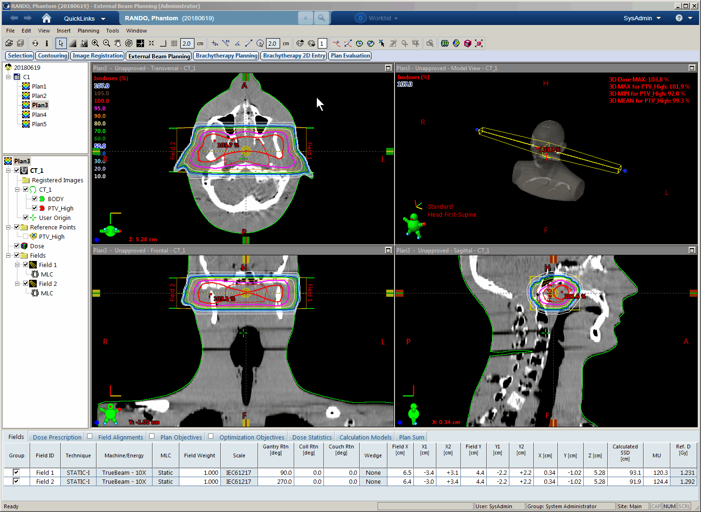
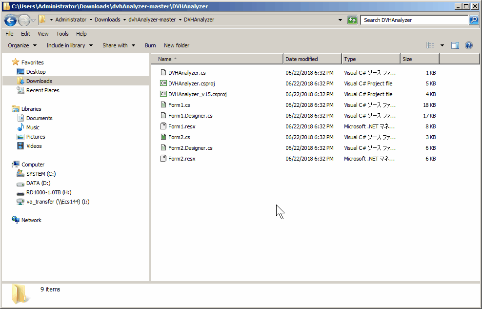

# dvhAnalyzer

Eclipse (Varian Medical Systems) で利用できるDVH解析用のESAPIプラグインです。

## 使い方

下記操作にて、DVH情報を取得できます。  

### DVH解析機能

Structure, DVHパラメータ（含入出力単位）を指定することでDVHの計算が可能です。  
また、許容値を設定することで結果の判定が可能です。基準値内（Criteriaの値）の場合は緑、許容範囲内（Criteria +/- Tolerance）は黄、範囲外は赤になります。  
CV/DCは
[AAPM TG-263](https://www.aapm.org/pubs/reports/RPT_263_Supplemental/default.asp)
で定義されている、低線量側のための指標です。  
Ex1) CV10Gy[cc]: 当該Structureの10Gy以下の体積を絶対値で示します。  
Ex2) DC0.1cc[Gy]: 当該Structureの最も線量の低い0.1 ccのうちの最大線量を示します。

### その他の機能

一度作成したDVH項目はTemplateとして保存可能です。
保存したTemplateを読み込む際は、Templateに登録されたStructure名と、現在開いているPlanのStructure名のマッチングを行うことで柔軟な対応が可能です。  
Export機能により、解析結果をCSVファイルとして出力することができます。  
Templateの保存先、解析結果の保存先フォルダをSettings画面より設定可能です。

## ビルド方法

Visual Studioを利用するか、あるいはコマンドラインベースで `DVHAnalyzer.csproj` をビルドして使用します。  
ここでは、Visual Studioなしでビルドする方法について紹介します。

1. MSBuild.exeを探す  
お使いのEclipse端末から、MSBuild.exeというプログラムを探します。  
通常は、 `C:\Windows\Microsoft.NET\Framework64\v4.0.30319\MSBuild.exe` に存在しています。  
(v4.0.30319はそれぞれの環境で異なる可能性があります。)

2. このリポジトリをダウンロードする  
画面右上付近にある、Clone or Download という緑色のボタンからDownload ZIPなどを選択し、ローカル環境にダウンロードしてください。  
ZIP形式でダウンロードした場合は適宜解凍し、Eclipse端末へコピーしてください。

3. コマンドプロンプトを立ち上げてビルドを実行する  
手順2でZIP形式でダウンロードして解凍した場合、`dvhAnalyzer-master` というフォルダができているかと思います。
その中にあるDVHAnalyzerというフォルダ内でコマンドプロンプトを立ち上げ、下記コマンドでビルドを実行します。  
DVHAnalyzerフォルダを開いた状態で、アドレスバーに `cmd` と入力するとその場所でコマンドプロンプトが立ち上がります。  

~~~Batchfile
C:\...\dvhAnalyzer-master\DVHAnalyzer> C:\Windows\Microsoft.NET\Framework64\v4.0.30319\MSBuild.exe DVHAnalyzer.csproj /p:Configuration=Release
~~~

Eclipse Ver. 15以降の場合

~~~Batchfile
C:\...\dvhAnalyzer-master\DVHAnalyzer> C:\Windows\Microsoft.NET\Framework64\v4.0.30319\MSBuild.exe DVHAnalyzer_v15.csproj /p:Configuration=Release
~~~

4. 生成ファイルをEclipse Scriptが実行可能なフォルダに移動する  
上記コマンドがうまくいくと、`plugins` というフォルダに `DVHAnalyzer.esapi.dll` というファイルが出来ているはずです。  
こちらをEclipseのExternal Beam PlanningのToolbarにある `Tools -> Scripts` で指定しているフォルダにコピーします。  

5. Eclipseにて線量計算済みのプランを開いて実行する

以上です。  

## Eclipseのバージョンが異なる場合

このプラグインは、Eclipse Ver. 13.7 で作成されています。
Ver. 11.0, Ver. 13.6, Ver. 13.7 および Ver. 15.1 でビルドおよび動作確認をしています。
Ver. 15以降の場合は、上記で使用している `DVHAnalyzer.csproj` を `DVHAnalyzer_v15.csproj` に読み替えてビルドを実行してください。  
その他のバージョンの場合や、ビルドがうまくいかない場合、うまく動作しない場合は、emt-mediphys@euro-meditec.co.jp までお気軽にお問合せください。

## Special Thanks

遠山尚紀さん、深田恭平さん、藤田幸男さん