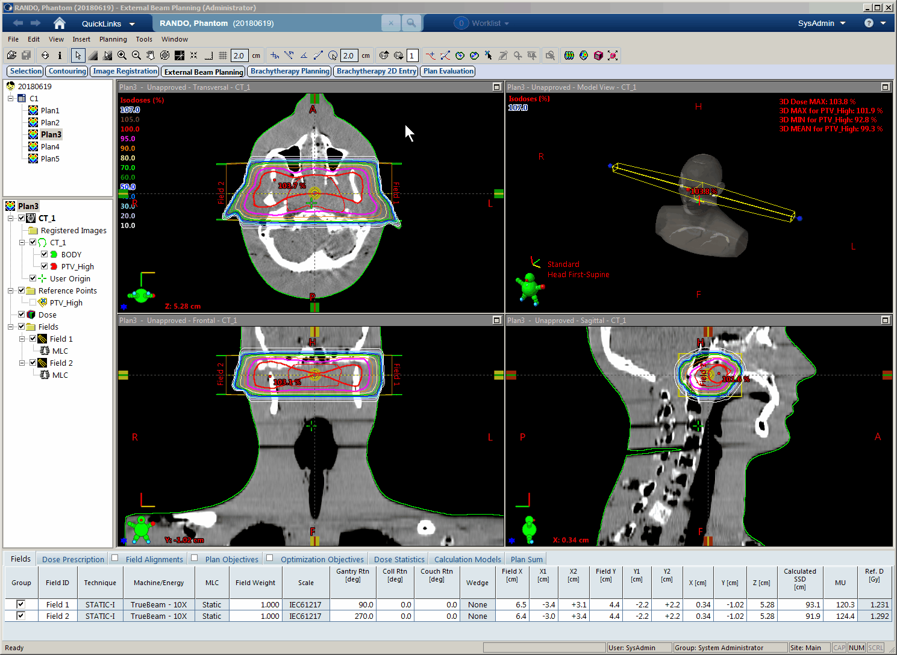
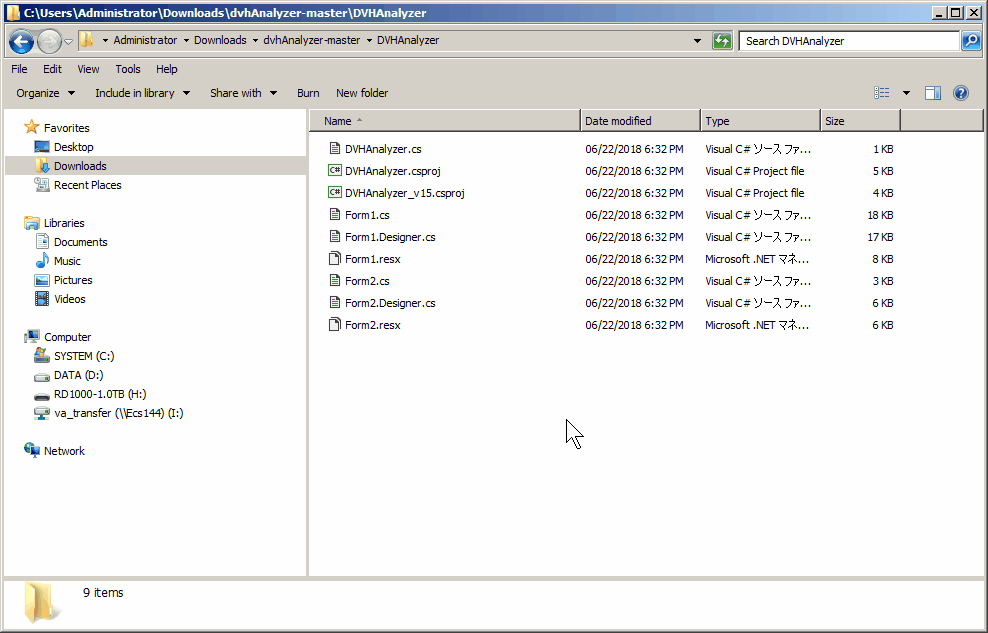

# dvhAnalyzer

Plugin for Eclipse (Varian Medical Systems) to analyze DVH

## How to Use

See below.

You can retrieve DVH parameters and judge whether the value meet the criteria with certain tolerance.
The parameters of "CV/DC" are for evaluating low dose region, defined at [AAPM TG-263](https://www.aapm.org/pubs/reports/RPT_263_Supplemental/default.asp).

Ex1) CV10Gy[cc]: Absolute volume below 10 Gy of selected structure  
Ex2) DC0.1cc[Gy]: Maximum dose of coolest 0.1 cc of selected structure

## How to build

You can build this plungin using `DVHAnalyzer.csproj`.

1. Find MSBuild.exe  
You should find MSBuild.exe in your Eclipse Workstation.
Normally, it exists in `C:\Windows\Microsoft.NET\Framework64\v4.0.30319\MSBuild.exe`. 
(v4.0.30319 will be different from environment.)

2. Download this repository 
Select "Clone or Download" and "Download ZIP" to save this repository for your local system.  
Unzip the file and copy to Eclipse Workstation.

3. Build in command prompt  
Now you have the directory of `dvhAnalyzer-master`.
You should launch the command prompt in the directory of `DVHAnalyzer`.
You can get the command prompt by inputting `cmd` in the address bar at `DVHAnalyzer`.

~~~Batchfile
C:\...\dvhAnalyzer-master\DVHAnalyzer> C:\Windows\Microsoft.NET\Framework64\v4.0.30319\MSBuild.exe DVHAnalyzer.csproj /p:Configuration=Release
~~~

If you use Eclipse after Ver. 15

~~~Batchfile
C:\...\dvhAnalyzer-master\DVHAnalyzer> C:\Windows\Microsoft.NET\Framework64\v4.0.30319\MSBuild.exe DVHAnalyzer_v15.csproj /p:Configuration=Release
~~~

4. Move binary to your script directory  
Now you have `DVHAnalyzer.esapi.dll` in the directory of `plugins`.
You execute this binary from External Beam Planning.

It's over.

## Special Thanks

Naoki Tohyama, Kyohei Fukada, Yukio Fujita